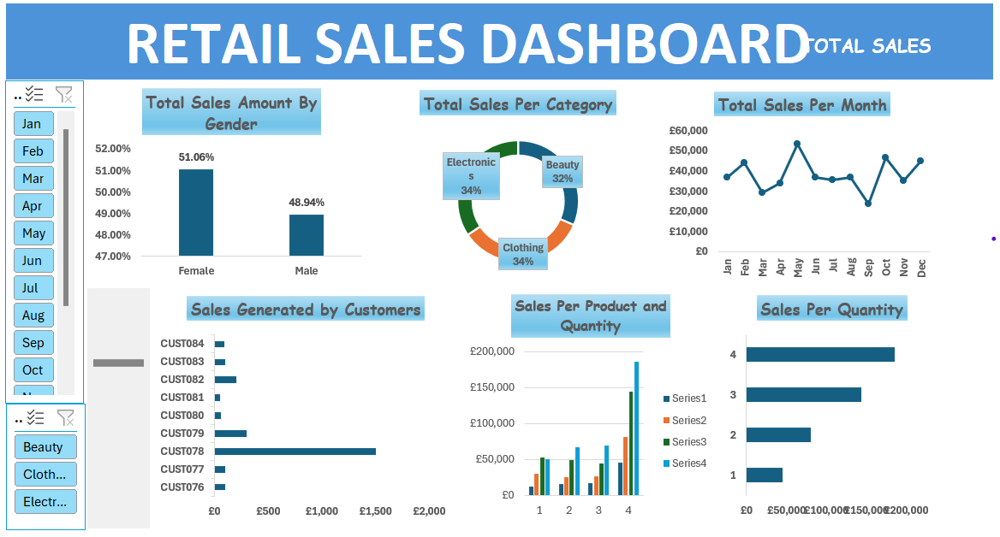

# Project 1

 **Title:**[Retail sales Dashboard](https://github.com/myvic70/myvic70.github.io/blob/main/Retail%20Sales.xlsx)
 
 **Tools Used:** Microsoft Excel (Pivot Chart, Pivot tables, Conditional formating, filters, slicers, timelines)

**Project Description:** This project involves analyzing transaction from a retail sales data system. Each record contains information about individual purchases made by different customers. The dataset is structured around key fields like customer ID, demographics, product categories, Quantities and financial details, allowing for insights into consumer behavior, sales trends, and demographic preferences.

By analyzing data like the Total Amount, Product Category, and Age Bracket, we were able to uncover pattern in purchasing behavior across different demographic groups, understand popular product categories, and also assess the impact of pricing strategies. Gender-based analysis reveals reveal shopping habits between males and females, 
 **Key findings:**
**Total Sales Amount by Gender**
Men make up 51·06 % of all sales and women contribute 48·94 %. This discovery aids businesses in determining which gender is driving revenue and whether they should prioritize targeting certain genders more effectively. 

**Total Sales per Category**
In terms of sales distribution across categories, Electronics and clothing account for the percentage of 34% each followed closely by clothing at 32%.
This discovery would bring attention to the sought after product categories and guide the company in focusing its inventory and marketing strategies, on these high selling categories. 

**Total Sales per Month**
Sales peaked in May, likely due to holiday shopping, contributing to 12% of annual sales. Conversely, sales were lowest in September and March, accounting for just 11% of total sales.
Seasonal trends can be identified here, helping the business prepare for periods of high demand or run special promotions during slower months.

**Sales per Product and Quantity**
The best-selling product is Electronics which has the highest number of quantity sold and generated £185,860 in revenue. 
Determining which products have the impact on sales can affect how we manage our inventory and plan our marketing campaigns effectively. This could mean that items with sales numbers but limited stock might be seen as top tier products; whereas goods, with high quantities but low sales might be popular yet not very profitable. 

**Key Takeaways:**

**Gender Sales Insights**: When a particular gender contributes significantly to sales figures, it could suggest an opportunity to enhance targeting strategies, for the gender through tailored marketing initiatives. 
Category Sales Focus: Prioritize marketing efforts and consider increasing inventory for categories; consider phasing out or offering discounts, for slower selling categories.

**Seasonality Trend**s: Matching marketing and inventory plans to sales fluctuations, on a basis can assist the company in leveraging peak seasons and handling finances efficiently during quieter periods. 

**High-Value Customers**: When we prioritize high value customers and tailor loyalty programs to their needs and preferences, we can boost revenue from those who are already spending more. This approach also encourages customers with value to make purchases more frequently. 

**Product Strategy**: Highlight in marketing the selling products while considering improving or removing underperformers from the catalog as part of the product strategy. 

 
**Dashboard Overview:**

